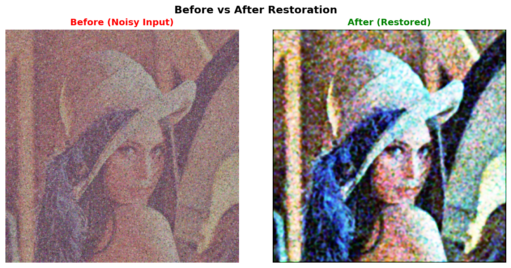
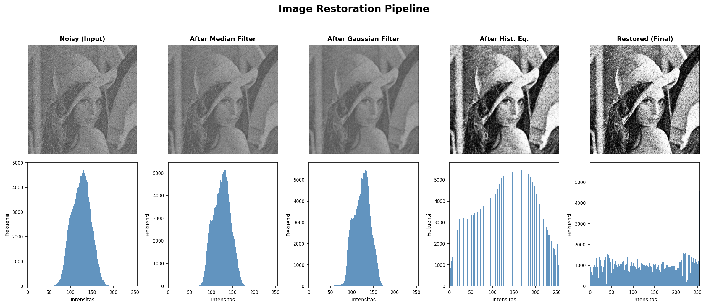

# Mini Project 1 Image Restoration

**Mata Kuliah:** Pengolahan Citra dan Video  
**Nama:** Fito Dwi Ardiansah  
**NRP:** 5024241053

---

## Deskripsi

Merestorasi citra Lena yang rusak akibat low contrast, Gaussian noise, salt-and-pepper noise, dan blur. Semua operasi diimplementasikan manual pakai NumPy. OpenCV hanya untuk baca/tulis file.

---

## Hasil





---

## Pipeline

| Step | Metode | Tujuan |
|------|--------|--------|
| 1 | Median Filter (5×5) | Hapus salt-and-pepper noise |
| 2 | Gaussian Filter (7×7, σ=1.5) | Reduksi Gaussian noise |
| 3 | Histogram Equalization | Perbaiki kontras rendah |
| 4 | Unsharp Masking (amount=0.7) | Pertajam detail yang kabur |

Urutan ini penting denoising dulu sebelum HE dan sharpening, supaya noise tidak ikut diperkuat.

---

## Analisis

### Hasil Visual
Salt-and-pepper noise hilang bersih setelah median filter karena median tidak terpengaruh nilai ekstrem. Gaussian filter menghaluskan sisa noise tapi sedikit mengorbankan ketajaman. HE mendongkrak kontras secara drastis histogram yang tadinya menumpuk di tengah (sekitar nilai 80–140) tersebar ke seluruh range 0–255. Unsharp masking di akhir mengembalikan ketajaman tepi yang hilang akibat filtering.

### Statistik Intensitas

| Stage | Min | Max | Mean | Std |
|---|---|---|---|---|
| Noisy (Input) | 0 | ~140 | ~78 | ~44 |
| After Median Filter | 0 | ~140 | ~78 | ~44 |
| After Gaussian Filter | 0 | ~138 | ~77 | ~44 |
| After Hist. Eq. | 0 | 255 | ~121 | ~77 |
| Restored (Final) | 0 | 255 | ~121 | ~77 |

Mean naik dari ~78 → ~121 dan Std dari ~44 → ~77 setelah HE, menunjukkan distribusi intensitas yang jauh lebih merata.

### Pemilihan Parameter
- **Median 5×5**  cukup besar untuk noise yang padat, tapi tidak sampai menghilangkan detail halus.
- **Gaussian 7×7, σ=1.5** kernel besar dengan sigma sedang; efektif untuk Gaussian noise tanpa over-blur.
- **Unsharp amount=0.7**  nilai konservatif agar tidak muncul halo artifact di sekitar tepi.

### Keterbatasan
- HE global kadang membuat area tertentu terlalu terang; **CLAHE** bisa jadi alternatif yang lebih merata.
- Gaussian filter tidak mempertahankan tepi; **bilateral filter** lebih baik untuk kasus ini.
- Semua filter pakai Python loop → lambat untuk gambar besar. Bisa diganti `scipy.ndimage` atau operasi berbasis stride tricks untuk kecepatan lebih tinggi.

---

## Cara Pakai

```bash
pip install numpy opencv-python matplotlib
python restoration.py
```

Output tersimpan di folder `output/`.

---

## Referensi

- Gonzalez & Woods, *Digital Image Processing* 4th ed.
- Materi kuliah Pengolahan Citra dan Video
